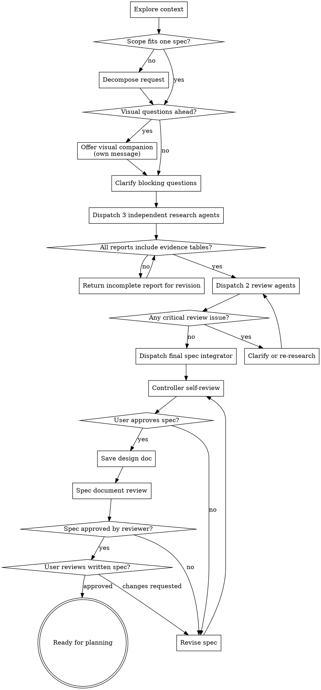

# Mobile Brainstorming

## Overview

Turn mobile ideas into approved design specs through independent agent research, review, and final synthesis. This skill is for design only.

<HARD-GATE>
Do not write code, scaffold files, create implementation plans, launch simulators, or make product decisions from the description alone.

Before proposing a solution, run the required 3 research agent + 2 review agent + 1 integration agent workflow, unless subagents are unavailable. If subagents are unavailable, state that limitation and ask whether to use a sequential fallback.

No implementation begins until the final spec is presented to the user and approved.
</HARD-GATE>

## Relationship To Standard Brainstorming

This skill extends standard `brainstorming` for mobile design work with independent subagent research and review.

| Standard brainstorming | Mobile brainstorming |
|---|---|
| One main agent explores options with the user | Three independent research agents propose distinct approaches |
| Main agent evaluates trade-offs | Two reviewer agents check requirements, feasibility, mobile constraints, and hallucination risk |
| Main agent writes the design | One final integrator creates the recommended spec from reviewed inputs |
| General software design | Mobile-specific UX, platform, device-state, accessibility, lifecycle, and verification concerns |
| Lightweight enough for simple work | Reserved for complex or ambiguous mobile work with competing directions |

## When To Use

Use for mobile work involving:
- New app features, screens, flows, navigation, onboarding, permissions, monetization, or release-sensitive UX
- Unclear product direction or competing approaches
- Trade-offs among user experience, implementation cost, platform constraints, accessibility, analytics, reliability, or performance
- Requests to design, brainstorm, compare options, or decide architecture before implementation

Do not use when:
- The user asks a factual mobile API question with no design decision
- The task is a tiny mechanical edit with an already approved design
- Fewer than two genuinely different approaches are plausible; use normal clarification instead

## Controller Checklist

Create a task for each item and complete them in order:

1. Explore project context: existing docs, app structure, design conventions, target platform clues.
2. Scope check: decide whether the request fits one spec. If too large, decompose before continuing.
3. Offer visual companion if upcoming questions need mockups, flows, or visual comparisons.
4. Clarify only what blocks useful research. Ask one question at a time.
5. Dispatch 3 independent research agents.
6. Verify each research report has an evidence table and a clear status.
7. Dispatch 2 review agents using all three reports.
8. Resolve review blockers. Critical issues stop synthesis.
9. Dispatch 1 final spec integrator.
10. Controller self-reviews the integrated spec.
11. Present the spec to the user for approval.
12. After approval, save the design doc to `docs/mobile-superpowers/specs/YYYY-MM-DD-<topic>-design.md`.
13. Run the spec document review loop with `spec-document-reviewer-prompt.md`.
14. Ask the user to review the written spec file before any implementation planning.

## Process Flow



## Visual Companion

If upcoming decisions involve layout, flow, hierarchy, gesture behavior, or screen comparisons, offer a visual companion before detailed questions:

> Some of what we're working on might be easier to explain if I can show it visually. I can put together mockups, flows, comparisons, or diagrams as we go. Want to try that?

This offer must be its own message. If the user declines, continue text-only.

## Research Agents

Dispatch exactly three independent research agents. They receive the same user goal and curated project context, but none of the other research agents' outputs.

Use fresh subagents. Do not fork or reuse context from another research agent. The controller may include curated project facts, but not another agent's analysis.

### Research Agent A: Conservative Fit

Focus on the smallest useful design that follows existing patterns and minimizes risk.

### Research Agent B: High-Leverage Product

Focus on a richer product/UX direction that may create more value if scope allows.

### Research Agent C: Mobile-Native Ergonomics

Focus on mobile platform constraints, touch ergonomics, device states, accessibility, performance, offline behavior, and lifecycle.

Use `research-agent-prompt.md` for the full dispatch template. Fill it with the exact user request, clarifications, curated context, and the assigned lane.

## Research Status Handling

If a research agent returns:

| Status | Controller action |
|---|---|
| `COMPLETE` | Check evidence table, then proceed |
| `NEEDS_CONTEXT` | Provide missing context and re-dispatch that agent |
| `BLOCKED` | Decide whether to clarify with the user, narrow scope, or replace that research lane |

Do not treat a blocked or context-starved report as one of the three required proposals.

## Review Agents

After all three research reports are complete, dispatch exactly two review agents. Reviewers see all three research reports and the original goal.

### Review Agent 1: Requirements and User Value

Checks whether proposals solve the user's actual problem, keep scope appropriate, avoid overbuilding, and identify missing questions.

### Review Agent 2: Feasibility, Mobile Constraints, and Skill Quality

Checks whether proposals are implementable, mobile-aware, reusable, well-gated, and credible.

Use `requirements-reviewer-prompt.md` for the full dispatch template.

Use `feasibility-reviewer-prompt.md` for the full dispatch template.

## Review Gate

Both review agents must return `Status: COMPLETE` and `Approval: APPROVED`, or approve with only non-blocking issues, before final synthesis.

If either reviewer returns `NEEDS_REVISION`:
- Do not synthesize the final spec.
- Ask the user for missing information, or re-dispatch the relevant research agent with specific revision instructions.
- Repeat review after revisions.

If a reviewer returns `NEEDS_CONTEXT` or `BLOCKED`, handle that status before synthesis. Do not reinterpret an incomplete review as approval.

## Final Spec Integrator

Dispatch one final integrator after review gate passes.

Use `final-spec-integrator-prompt.md` for the full dispatch template.

## Prompt Templates

The full subagent prompt templates live beside this skill:

- `research-agent-prompt.md`
- `requirements-reviewer-prompt.md`
- `feasibility-reviewer-prompt.md`
- `final-spec-integrator-prompt.md`

Load only the template you need at dispatch time.

## Controller Self-Review

After receiving the integrated spec, review it yourself before showing it to the user:

1. Placeholder scan: no TBD, TODO, "decide later", or vague acceptance criteria.
2. Consistency: goals, non-goals, user flow, gates, and acceptance criteria do not contradict.
3. Scope: spec is small enough for one implementation plan.
4. Evidence: major claims are tagged as user input, repo context, inference, assumption, or needs verification.
5. Mobile coverage: safe areas, keyboard, loading/error/empty states, accessibility, offline/lifecycle/performance are either addressed or explicitly non-goals.
6. No fabrication: no repo features, platform capabilities, dependencies, or user needs are stated as facts without source.
7. Agent integrity: the spec distinguishes independent research findings, reviewer findings, and integrator choices.

Fix issues inline. If fixing requires new information, ask the user one question at a time.

## Spec Document Review Loop

After saving the approved spec, dispatch a fresh reviewer with `spec-document-reviewer-prompt.md`.

Reviewer inputs:

- Original user goal
- Spec path and full spec content
- Target platforms
- Visual artifacts, if any
- Research/reviewer/integrator summary

Required reviewer output:

- `Status: APPROVED`, `ISSUES_FOUND`, or `BLOCKED`
- Blocking issues
- Non-blocking recommendations
- Missing evidence or assumptions
- Mobile coverage notes

If status is `APPROVED`, proceed to the user review gate.

If status is `ISSUES_FOUND`, revise the spec, repeat controller self-review, save the file, and re-run the spec reviewer.

If status is `BLOCKED`, ask the user for the missing context or narrow the scope before continuing.

If reviewer feedback is technically wrong, explain the disagreement in the spec's source trace or reviewer findings and re-run review. If the same disagreement repeats three times, surface it to the user.

## Presenting The Design

Present the final spec in sections scaled to complexity. Ask whether it looks right before saving.

Cover:
- Problem and goals
- Recommended approach
- User flow
- Mobile constraints
- Gates and verification
- Alternatives rejected
- Open questions

Do not proceed to implementation planning until the user approves the design.

## Design Doc Format

After approval, save the spec to:

```text
docs/mobile-superpowers/specs/YYYY-MM-DD-<topic>-design.md
```

Use this structure:

```markdown
# <Topic> Design

## Problem
## Goals
## Non-Goals
## User Context
## Recommended Approach
## User Flow
## Mobile Constraints
## Agent Orchestration
## Gates
## Hallucination and Credibility Controls
## Alternatives Considered
## Reviewer Findings
## Open Questions
## Acceptance Criteria
## Source Trace
```

After saving, ask:

> Spec written to `<path>`. Please review it and tell me if you want changes before we start implementation planning.

If the user requests changes, revise the spec, repeat controller self-review, update the file, and ask again.

The terminal state of this skill is a user-approved written spec. Do not create an implementation plan unless a planning skill exists and the user asks to continue.

## Credibility Register

Every design doc must include a source trace table:

```markdown
| Claim | Source | Confidence | Action |
|---|---|---|---|
| Users need offline behavior | Inference | Low | Ask before implementation |
| Safe area behavior matters | Mobile constraint | High | Include in design checks |
| Existing app has onboarding analytics | Needs verification | Low | Inspect code before planning |
```

Source values:
- `User input`
- `Repo context`
- `Research proposal`
- `Reviewer finding`
- `Mobile constraint`
- `Inference`
- `Assumption`
- `Needs verification`

## Red Flags

Stop if you catch yourself doing any of these:

- Proposing a design before the 3 + 2 + 1 workflow finishes.
- Asking three or more clarifying questions at once.
- Dispatching research agents before clarifying a blocking ambiguity.
- Letting research agents see each other's outputs.
- Counting a `NEEDS_CONTEXT` or `BLOCKED` report as complete.
- Treating an inference as a fact.
- Ignoring a reviewer `NEEDS_REVISION`.
- Adding "nice to have" scope because it sounds mobile-friendly.
- Saving a spec before user approval.
- Skipping written-spec review after saving.
- Starting implementation planning before approval.
- Claiming independent review happened when subagents were unavailable.

## Sequential Fallback

If subagents are unavailable:

1. State: "Subagents are unavailable, so I cannot perform the required independent mobile brainstorming workflow."
2. Ask whether the user wants a sequential fallback.
3. If approved, run the same roles sequentially and label the result as sequential, not independent.
4. Keep the same evidence, review, and user approval gates.

Do not silently downgrade to sequential work.

## Testing This Skill

Use `pressure-tests.md` when evaluating changes to this skill. At minimum, verify:

- Natural mobile design prompts trigger this skill.
- Explicit requests load this skill before file reads, shell commands, or subagents.
- Pressure to skip "because this is just brainstorming" does not bypass the 3 + 2 + 1 workflow.
- Overbroad requests do not cause uncontrolled agent fan-out.
